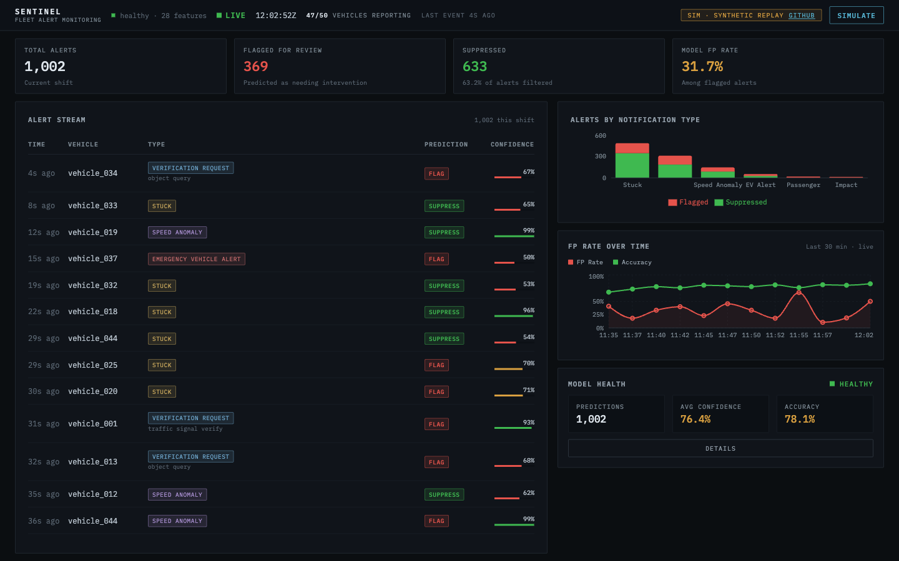
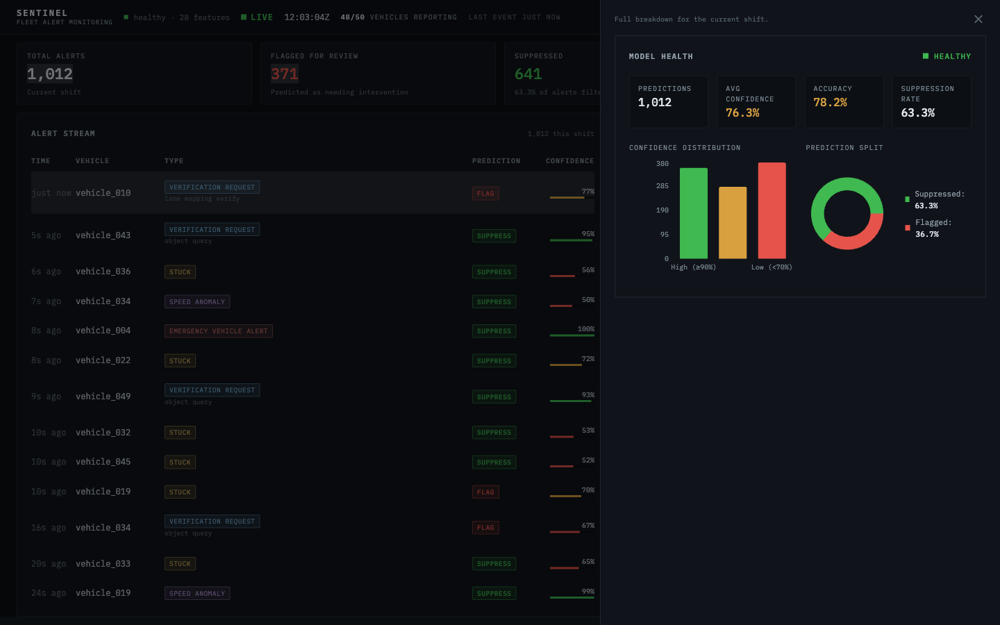

# Sentinel

      

**Context-aware alert filtering for autonomous vehicle fleets**

Sentinel is a full-stack system that reduces operator alert fatigue by learning which fleet notifications actually need human intervention. It combines an XGBoost classifier trained on 28 engineered features with a FastAPI inference service and a React monitoring dashboard, all containerized with Docker Compose.

On a 500-vehicle fleet simulation, the model cuts the false-positive rate of surfaced alerts from 61% to 32% — a **47% reduction** that eliminates roughly **1.8 million false alarms per simulated day** — while catching 79% of real interventions. Metrics are measured on an event-grouped held-out test set (no leakage between train and test; see [Synthetic Data & Limitations](#synthetic-data--limitations)).

---

## Screenshots

### Main Dashboard
Overview cards, live alert feed, and per-type breakdown.



### Model Health Monitoring
Confidence distribution, prediction split, accuracy tracking, and status indicators.



---

## Quick Start

The entire stack runs with one command. No manual database setup, no separate API launch. The entrypoint script handles schema creation, auto-seeding, and startup.

```bash
# Clone and start
git clone https://github.com/DerekZ-113/Sentinel.git
cd Sentinel
docker-compose up --build

# That's it. Open the dashboard:
# http://localhost:3000
```

On first run, the API container waits for the database, sets up the schema, seeds 1,000 demo notifications through the model, and starts serving. The dashboard pulls from the API and renders immediately.

**API docs (Swagger):** http://localhost:8000/docs

---

## The Problem

AV fleet operators are drowning in notifications:

| Notification Type | What It Means | Reality |
|-------------------|---------------|---------|
| **Object Query** | "Is something blocking me?" | 83% are false positives (someone just walked by) |
| **EV Alert** | "Emergency vehicle detected" | 70% are false positives (EV too far away) |
| **Stuck** | "I can't move" | 62% are false positives (traffic or red light) |

**Baseline: 61.4% of all notifications are false positives.**

When everything is an alert, nothing is an alert. Real issues get buried in noise.

---

## The Solution

Sentinel uses an XGBoost classifier with interaction features built from operational experience to predict which notifications actually need operator intervention.

The key insight is that context matters. A "stuck" notification during rush hour traffic is almost always a false positive. A "stuck" notification on a clear highway probably needs attention. The model learns these contextual patterns through 11 hand-crafted interaction features that encode the operational knowledge behind when an alert is real versus noise.

---

## Results

All metrics come from an **event-grouped 70/15/15 train/val/test split**: a notification event emits a stream of near-identical 5-second samples, and every sample of an event stays on one side of every split boundary. Early stopping selects on the validation set; the test set is untouched until final evaluation.

### Overall Performance

| Metric | Baseline | Sentinel | Improvement |
|--------|----------|----------|-------------|
| False Positive Rate | 61.4% | 32.2% | -47% |
| Precision | 38.6% | 67.8% | +76% |
| Recall | 100% | 79.3% | - |
| F1 Score | - | 73.1% | - |
| ROC-AUC | - | 0.864 | - |
| PR-AUC | - | 0.810 | - |

### Per-Notification-Type Breakdown

| Type | Baseline FP | Sentinel FP | Reduction | AUC |
|------|-------------|-------------|-----------|-----|
| verification_request/object_query | 83.2% | 42.9% | -48% | 0.874 |
| speed_anomaly | 58.5% | 21.8% | -63% | 0.963 |
| emergency_vehicle_alert | 70.1% | 46.7% | -33% | 0.856 |
| stuck | 61.6% | 40.7% | -34% | 0.709 |
| impact_l0 | 47.2% | 46.4% | -2% | 0.602 |
| verification_request/lane_mapping_verify | 31.3% | 31.3% | 0% | 0.528 |
| verification_request/traffic_signal_verify | 10.3% | 10.3% | 0% | 0.521 |
| passenger_assist | 0.0% | 0.0% | N/A | - |

The per-type AUC column is honest about where the signal lives: types whose labels depend on observable context (object_query, speed_anomaly, EV alerts) are learnable; types whose false positives are near-random in the generator (impact_l0, the low-volume verification subtypes) hover near coin-flip — the model correctly falls back to flagging most of them rather than inventing confidence.

### Operator Impact

Per simulated day, from full-dataset counts (26.7M notification samples / 1.03M notification events over 7 days — "alerts" here are 5-second notification samples, ≈146K distinct events per day):

| Metric (per simulated day) | Baseline | Sentinel |
|----------------------------|----------|----------|
| Alert samples surfaced | 3.82M | 1.72M |
| False alarms surfaced | 2.31M | 0.56M |
| Real interventions caught | 1.50M | 1.17M |
| Workload | 100% | 45% |

**~1.8 million false alarms eliminated per simulated day.**

---

## Synthetic Data & Limitations

All training and demo data comes from a fleet **simulation** (`fleet_data/generate_fleet_data.py`), not real vehicles. The simulation is deliberately built so the model has to earn its numbers:

- **Context signals are probabilistic and overlapping — labels are never encoded into features.** For `object_query`, an obstruction is present with p=0.85 when intervention is needed and p=0.15 when not; `emergency_vehicle_alert` draws distances from overlapping ranges (real: 10–250 m, false: 80–500 m); `speed_anomaly` uses overlapping speed multipliers (0.15–0.45 vs 0.35–0.65). The model has to learn a genuine decision boundary in every case.
- **Splits are grouped by notification event.** One event yields ~26 near-identical 5-second samples sharing a label; grouping keeps siblings out of the test set, so the metrics measure generalization to unseen events, not memorization of event fingerprints. Early stopping uses a separate validation split.
- **The remaining caveat is the simulation itself.** Labels come from hand-written context rules, so the model is partially recovering a hand-designed generative process. The numbers describe performance on this synthetic distribution, not expected real-world performance.

The hosted demo dashboard replays this synthetic dataset on a loop; its "live" activity is a replay, not real fleet traffic. Data generation is seeded (`--seed 42`) and reproducible end-to-end via `python -m ml.run_pipeline`.

---

## Architecture

```
docker-compose up
     |
     v
+------------------------------------------------------------+
|                    Docker Compose                          |
|                                                            |
|  +-------------+    +--------------+    +---------------+  |
|  | React/TS    |--->|   FastAPI    |--->|  TimescaleDB  |  |
|  | Dashboard   |    |   Backend    |    |               |  |
|  | :3000       |    |   :8000      |    |  :5432        |  |
|  | (nginx)     |    |              |    |               |  |
|  +-------------+    +------+-------+    +---------------+  |
|                            |                               |
|                     +------+-------+                       |
|                     |   XGBoost    |                       |
|                     |   Model      |                       |
|                     |  (loaded)    |                       |
|                     +--------------+                       |
+------------------------------------------------------------+
```

The nginx layer in the dashboard container proxies `/api/*` requests to FastAPI, so the frontend and backend share the same origin in production. During development, the Vite dev server (also on `localhost:3000`) proxies `/api` and `/health` to the backend on `:8000`, so the frontend and backend share an origin there too.

---

## API Endpoints

| Method | Endpoint | Description |
|--------|----------|-------------|
| POST | `/api/predict` | Send a notification payload, get back a prediction with confidence score |
| GET | `/api/alerts` | Recent predictions with optional type filter and pagination |
| GET | `/api/stats` | Aggregate stats over a time window (total, flagged, suppressed, FP rate) |
| GET | `/api/stats/{type}` | Per-notification-type breakdown |
| GET | `/api/stats/model-health` | Model health metrics: accuracy, confidence distribution, prediction split |
| GET | `/health` | Service health check (model loaded, DB connected, uptime) |

All endpoints return JSON. Full schema documentation is available at `/docs` when the API is running.

---

## Dashboard

The React dashboard is an above-the-fold operations console:

- **Overview Cards** - Total alerts, flagged count, suppressed count, and model FP rate at a glance.
- **Alert Feed** - Scrollable table of recent notifications showing vehicle ID, type, model prediction, and confidence score. In demo mode this is a live stream: click any alert for a detail drawer with the model score vs. threshold, context signals, telemetry, a sector mini-map, and the vehicle's recent history.
- **Type Breakdown** - Stacked bar chart comparing flagged vs suppressed counts for each notification type.
- **FP Rate Trend** - False positive rate and accuracy over time (rolling 30-minute window in demo mode).
- **Simulate** - Interactive form where you can input notification parameters and get a prediction. In demo mode it opens as a drawer and injects the result into the live stream as a manual alert.
- **Model Health** - Confidence distribution (high/medium/low buckets), prediction split (flagged vs suppressed), accuracy, and a status indicator (healthy/warning/degraded).

### Demo mode

The hosted demo (`VITE_DEMO_MODE=true`) has no backend: a replay engine deals the 1,000 bundled synthetic alerts onto a live timeline (Poisson-spaced, with bursts), and every surface — counters, charts, feed, model health — derives from that single stream. A status bar shows the honest fleet-reporting count and a dismissible synthetic-replay notice. Live-API builds tree-shake the entire demo layer, fixtures included.

---

## Feature Importance

The interaction features built from operational patterns became the top predictors:

| Rank | Feature | Importance | Type |
|------|---------|------------|------|
| 1 | `object_in_path` | 16.2% | Context |
| 2 | `stuck_clear_road` | 13.8% | Interaction |
| 3 | `notification_subtype_encoded` | 11.3% | Base |
| 4 | `notification_type_encoded` | 9.8% | Base |
| 5 | `object_query_moving` | 7.8% | Interaction |
| 6 | `ev_close` | 4.3% | Interaction |
| 7 | `object_query_high_ped` | 3.7% | Interaction |
| 8 | `ev_distance_normalized` | 3.4% | Context |
| 9 | `object_query_low_ped` | 3.4% | Interaction |
| 10 | `impact_rough_road` | 3.3% | Interaction |

6 of the top 10 features are interaction features - patterns I learned from working operations.

---

## Features (28 total)

### Base Features (17)

| Feature | Description |
|---------|-------------|
| `speed_ratio` | actual_speed / expected_speed |
| `speed_deviation` | actual_speed - expected_speed |
| `is_stopped` | speed < 5 mph |
| `expected_stopped` | expected_speed < 5 mph |
| `road_type_encoded` | highway, main_road, residential, downtown, school_zone |
| `traffic_encoded` | light, moderate, heavy, standstill |
| `construction_encoded` | none, temporary, persistent, flagger |
| `notification_type_encoded` | 6 notification types |
| `notification_subtype_encoded` | 3 subtypes for verification_request |
| `ev_distance_normalized` | distance to emergency vehicle |
| `pedestrian_density` | nearby pedestrian activity (0-1) |
| `object_in_path` | is there actually an obstruction |
| `time_since_stop_normalized` | how long vehicle has been stopped |
| `hour_sin`, `hour_cos` | cyclical time encoding |
| `high_traffic` | heavy traffic or construction |
| `high_pedestrian` | high pedestrian area |

### Interaction Features (11)

| Feature | What It Captures | Signal |
|---------|------------------|--------|
| `stuck_in_traffic` | Stuck + heavy traffic | Strong FP indicator |
| `stuck_in_construction` | Stuck + construction zone | Strong FP indicator |
| `stuck_clear_road` | Stuck + clear conditions | Real intervention likely |
| `object_query_high_ped` | Object query + busy area | Strong FP indicator |
| `object_query_low_ped` | Object query + empty area | Real intervention likely |
| `object_query_moving` | Object query + vehicle moving | Real intervention likely |
| `ev_far_away` | EV alert + far distance (>200m) | Strong FP indicator |
| `ev_close` | EV alert + close (<50m) | Real intervention likely |
| `speed_anomaly_in_traffic` | Slow + heavy traffic | Strong FP indicator |
| `speed_anomaly_clear` | Slow + clear road | Real intervention likely |
| `impact_rough_road` | Impact + residential/downtown | FP indicator (speed bumps) |

---

## Development Journey

### Phase 1: ML Pipeline

**Attempt 1: VAE Anomaly Detection.**
Trained a Variational Autoencoder on false positives only, expecting real interventions to have high reconstruction error. Result: 1.05x separation ratio. The model couldn't distinguish FPs from real interventions because the VAE learns global feature distributions and missed the contextual interactions.

**Attempt 2: VAE + Interaction Features.**
Added the 11 interaction features to help the VAE see the patterns. Still 1.05x separation. The interaction features got diluted across all notification types in the global distribution.

*The VAE code has been removed from the repository and the PyTorch dependency dropped. The experiments are documented here for the learning value.*

**Attempt 3: XGBoost Classifier.**
Supervised classification with interaction features. The interaction features became top predictors. For tabular data with categorical features, feature engineering often matters more than model architecture.

**Attempt 4: The honest retrain.**
An adversarial review of my own pipeline found the first XGBoost result (64% FP reduction, 0.946 ROC-AUC) was inflated by two bugs: sibling samples of the same notification event were leaking across the random row-level train/test split, and three notification types had their labels deterministically encoded into generator features (`object_in_path` was literally set equal to the label). I rebuilt the generator with probabilistic, overlapping context signals, reconstructed event IDs, switched to an event-grouped train/val/test split with validation-based early stopping, and dropped a training/serving scaler mismatch by removing scaling entirely (XGBoost doesn't need it). The honest numbers — 47% FP reduction, 0.864 ROC-AUC — are lower and real, and finding the leak taught me more than the inflated result ever did.

### Phase 2: Production System

Built the inference and monitoring layer on top of the trained model:
- FastAPI backend serving real-time predictions with Pydantic validation and connection pooling
- React/TypeScript dashboard with five monitoring panels and interactive simulation
- Model health tracking with confidence distribution, accuracy monitoring, and status indicators
- Docker Compose orchestration with automatic schema setup and demo seeding
- nginx reverse proxy for unified frontend/API routing

---

## Project Structure

```
sentinel/
├── api/
│   ├── main.py                  # FastAPI app, lifespan, health endpoint
│   ├── models.py                # Pydantic request/response schemas
│   ├── auth.py                  # API key authentication
│   ├── logging_config.py        # Structured logging setup
│   ├── routes/
│   │   ├── predict.py           # POST /api/predict
│   │   ├── alerts.py            # GET /api/alerts
│   │   └── stats.py             # GET /api/stats, /stats/model-health
│   └── services/
│       ├── model_service.py     # XGBoost loading, feature engineering
│       └── db_service.py        # TimescaleDB queries, connection pool
├── dashboard/
│   └── src/
│       ├── App.tsx              # Layout with sidebar navigation
│       ├── components/
│       │   ├── AlertFeed.tsx    # Recent alerts table
│       │   ├── ModelHealth.tsx  # Model monitoring panel
│       │   ├── OverviewCards.tsx # Summary stat cards
│       │   ├── SimulatePanel.tsx # Interactive prediction form
│       │   └── TypeBreakdown.tsx # Per-type bar chart
│       └── services/api.ts      # API client with TypeScript interfaces
├── fleet_data/
│   ├── generate_fleet_data.py   # 500-vehicle fleet simulation
│   ├── baseline_alerter.py      # Baseline false positive analysis
│   └── useful_queries.sql       # SQL analysis queries
├── ml/
│   ├── constants.py             # Shared encoding maps (single source of truth)
│   ├── prepare_data.py          # Feature engineering (28 features)
│   ├── train_classifier.py      # XGBoost training and evaluation
│   ├── run_pipeline.py          # End-to-end ML pipeline
│   ├── xgboost_model.json       # Trained model (committed)
│   └── model_config.json        # Feature columns + threshold (plain JSON)
├── scripts/
│   └── seed_demo.py             # Generate and seed 1,000 demo predictions
├── docker-compose.yml           # Full stack: DB + API + Dashboard
├── Dockerfile.api               # Python 3.11 with model files
├── Dockerfile.dashboard         # Multi-stage: node build, nginx serve
├── nginx.conf                   # Proxy /api/ to FastAPI, SPA fallback
├── entrypoint.sh                # DB wait, schema setup, auto-seed, start
├── tests/
│   ├── unit/                    # Unit tests (models, services, features)
│   ├── integration/             # API endpoint tests
│   └── ml/                      # ML pipeline and parity tests
├── .github/workflows/ci.yml    # GitHub Actions CI pipeline
├── .env.example                 # Environment variable template
├── setup_database.py            # TimescaleDB schema and hypertable
└── requirements.txt
```

---

## Tech Stack

- **Backend:** FastAPI, Pydantic, psycopg2 connection pooling
- **Frontend:** React 19, TypeScript, Recharts, Tailwind CSS
- **ML:** XGBoost, scikit-learn, NumPy
- **Database:** TimescaleDB (time-series optimized PostgreSQL)
- **Infrastructure:** Docker Compose, nginx reverse proxy, multi-stage builds
- **Testing:** pytest (240+ tests), Vitest (100+ tests), GitHub Actions CI

---

## Notification Types

| Type | Subtype | Description | Baseline FP Rate |
|------|---------|-------------|------------------|
| **verification_request** | object_query | "Is something in my path?" | 83% |
| | traffic_signal_verify | "Is this signal correct?" | 10% |
| | lane_mapping_verify | "Do lanes match my map?" | 30% |
| **emergency_vehicle_alert** | - | "EV detected nearby" | 70% |
| **stuck** | - | "I can't move forward" | 61% |
| **speed_anomaly** | - | "I'm slower than expected" | 57% |
| **impact_l0** | - | "Low-speed impact detected" | 47% |
| **passenger_assist** | - | "Rider requested help" | 0% (always real) |

---

## Author

**Derek Zhang**  
MS Computer Science, Northeastern University  
[LinkedIn](https://linkedin.com/in/derek-zhang-963169230) | [GitHub](https://github.com/DerekZ-113)

*Built from 3 years at Zoox working with autonomous vehicle fleet operations.*
